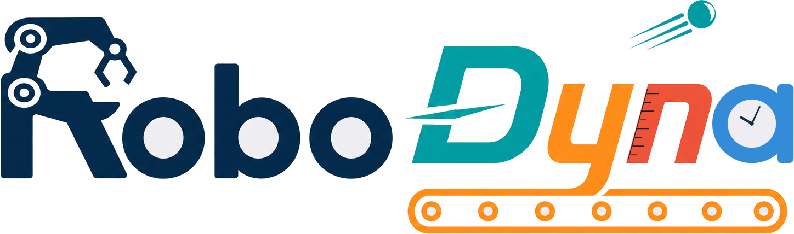

<div align="center">
  <a href="https://robodyna.github.io/robodyna/"></a>

  <h3>Benchmarking Robotic Manipulation under Physically Realistic Dynamics</h3>

  <p><b>Accepted at the NeurIPS 2026 Workshop on Robot Learning with World Models</b></p>

  <p>
    <a href="https://robodyna.github.io/robodyna/paper/robodyna_neurips2026_workshop.pdf"><b>Paper</b></a> ·
    <a href="https://robodyna.github.io/robodyna/"><b>Project page</b></a> ·
    <a href="https://robodyna.github.io/robodyna/#gallery">Task gallery</a> ·
    <a href="https://huggingface.co/RoboDyna">🤗 Data &amp; assets</a> ·
    <a href="https://robodyna.github.io/robodyna/arcade.html">Arcade</a>
  </p>
</div>

RoboDyna is a benchmark for evaluating the physical understanding and action capabilities of manipulation
policies in dynamic scenes. Objects roll, bounce, slide, fall, ripen and boil under simulated physics rather than
scripted motion, and the world keeps moving while the policy thinks.

- **30 dynamic tasks.** 20 conceptual tasks in minimal scenes, four in each of five capability categories, plus
  10 household tasks that test the same capabilities in cluttered office and kitchen scenes.
- **Composable difficulty.** Each conceptual task has four conditions: `base` (easy), `var1` and `var2` (medium,
  one variation each), and `var1+2` (hard, both variations, withheld from training).
- **3,500 expert demonstrations** from task-specific expert controllers.
- **Paired synchronous and asynchronous evaluation** on identical seeds. Asynchronous evaluation lets the scene
  keep evolving for the measured inference time, so latency counts.
- **Success rate and progress score.** `PS = b · 2^-m` credits completion milestones and halves for each error.
- **Human baselines** from twelve participants, with teleoperation and scene-interactive controls on the same seeds.

## Capability categories

| Category | What it tests | Conceptual tasks |
|---|---|---|
| Trajectory prediction | Anticipate where a moving object will be, including after contact | Catch Ramp Ball, Catch Valley Ball, Stop Valley Ball, Save Goal |
| Periodic pattern | Identify recurring motion and act in short time windows | Catch Marbles Trapdoors, Catch Cuboid, Drop Ball Hole, Whack Moles |
| Dynamic avoidance | Move around independently moving objects and obstacles | Put Cup Belt, Hit Target, Load Train, Place Block Belt |
| State transition | Track changes not captured by pose, such as ripeness or doneness | Cook Meat Timer, Pick Ripe Apple, Sort Apples Belt, Pack Fruits |
| Static to dynamic | Anticipate motion the robot itself triggers | Catch Shelf Marble, Dispense Gummy, Marble Shelf Maze, Play Billiard |

Household tasks: Boil Milk, Catch Cup, Catch Mouse Object Drop, Clean Table, Cook Food Timer, Make Soup,
Measure Ingredient, Pour Beer, Stop Ball, Trap Bug.

Demos of every task and condition are in the [task gallery](https://robodyna.github.io/robodyna/#gallery).

## Results

Success rate averaged over the synchronous and asynchronous protocols. Easy is `base`, Medium averages `var1`
and `var2`, Hard is the held-out `var1+2`. Overall covers Easy, Medium and household tasks.

| Policy (latency) | Conceptual Easy | Medium | Hard | Household | Overall |
|---|---:|---:|---:|---:|---:|
| π0.5 (109 ms) | **0.23** | **0.18** | **0.14** | **0.07** | **0.18** |
| X-VLA (156 ms) | 0.16 | 0.10 | 0.09 | **0.07** | 0.11 |
| FastWAM (236 ms) | 0.07 | 0.06 | 0.04 | 0.04 | 0.06 |
| Human, teleoperation | – | – | 0.44 | 0.61 | – |
| Human, scene-interactive | – | – | 0.73 | 0.84 | – |

No policy solves even one in five episodes. Moving from synchronous to asynchronous evaluation changes average
success by at most 0.03 but flips 5–12% of episode outcomes. The full table by category, protocol and metric is
on the [project page](https://robodyna.github.io/robodyna/#results).

## Quick start

Requirements: Linux, an NVIDIA GPU with a CUDA-capable driver, Python 3.10, Vulkan, and FFmpeg.

```bash
git clone https://github.com/robodyna/robodyna.git
cd robodyna

# Creates the `robodyna` conda environment and installs SAPIEN, CuRobo, etc.
bash script/install_robodyna.sh
conda activate robodyna

# Downloads the minimal runtime asset package (~1.2 GiB).
bash script/_download_assets.sh
```

For headless collection or recording:

```bash
export VK_ICD_FILENAMES=/usr/share/vulkan/icd.d/nvidia_icd.json
unset DISPLAY
```

## Use RoboDyna

Explore every task, and run the human-baseline experiments, in the unified GUI:

```bash
python interactive/robodyna_gui.py
```

Collect expert demonstrations:

```bash
# bash scripts/collect_data.sh <task> <task_config> <gpu_id> [scenario]
bash scripts/collect_data.sh catch_ramp_ball demo_dynamic 0 opt1
bash scripts/collect_data.sh boil_milk demo_dynamic 0
```

`demo_dynamic` is the production profile (50 successful episodes; head and wrist D435 cameras at 320×240).
Data is saved under `data/<task>/<scenario>/`, with a LeRobot v2.1 export under `data_lerobot/`. Scenarios
`default`, `opt1`, `opt2` and `opt1+2` correspond to the paper's `base`, `var1`, `var2` and `var1+2`.

Evaluate a policy under either protocol:

```bash
# bash policy/<policy>/eval.sh <task> <task_config> <ckpt> <tag> <seed> <gpu_id> [scenario] [frozen|async]
bash policy/xvla/eval.sh catch_ramp_ball demo_dynamic RoboDyna/X-VLA-RoboDyna xvla 0 0 default async
```

See `policy/pi05/`, `policy/xvla/` and `policy/fwam/` for the three policies evaluated in the paper.

## Repository guide

| Location | Purpose |
|---|---|
| `envs/` | Task environments, scoring, robots, and asset integration |
| `interactive/` | Task, household and human-experiment GUIs |
| `task_config/` | Collection settings, scenarios, evaluation seeds, and task instructions |
| `script/` | Collection, evaluation, export and benchmark utilities |
| `scripts/` | Shell launchers |
| `policy/` | π0 / π0.5, X-VLA and FastWAM integrations |
| `docs/` | Project page, task gallery and arcade |
| [`RoboDyna/RoboDyna-assets`](https://huggingface.co/datasets/RoboDyna/RoboDyna-assets) | Versioned runtime meshes and textures |

Each task has one language instruction in [`task_config/task_instructions.json`](task_config/task_instructions.json),
shared by the GUI, policy evaluation and LeRobot export. [`task_config/eval_seeds.yml`](task_config/eval_seeds.yml)
holds the fixed seeds shared by human experiments and policy evaluation.

## Citation

```bibtex
@inproceedings{li2026robodyna,
  title     = {Benchmarking Robotic Manipulation under Physically Realistic Dynamics},
  author    = {Li, Zhiyuan and Yang, Ruiheng and Zhao, Xuan and Rasouli, Amir},
  booktitle = {NeurIPS 2026 Workshop on Robot Learning with World Models},
  year      = {2026}
}
```

## Acknowledgement

RoboDyna builds on [RoboTwin 2.0](https://github.com/RoboTwin-Platform/RoboTwin),
[DOMINO](https://github.com/h-embodvis/DOMINO), and [SAPIEN](https://github.com/haosulab/SAPIEN).
